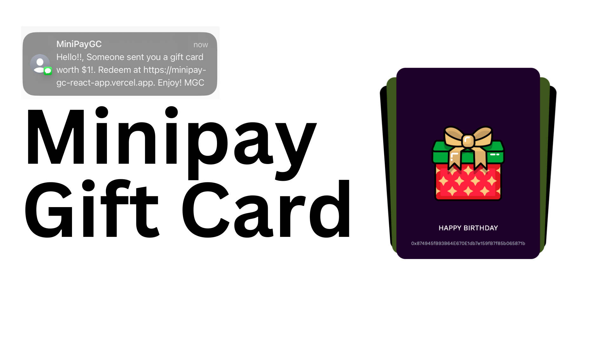

<!-- TITLE -->
 <h2 align="left">Minipay Gift Card </h2>

 
  
 
Send personalized, secure digital gift cards to loved with minipay. Mint unique ERC721 cards with ERC20 tokens, add messages, and spread joy with effortless gifting

<!-- ABOUT THE PROJECT -->

## About The Project

In modern digital transactions, there is a significant gap in providing personalized and secure digital gift solutions.
Existing systems often lack personalization, flexibility, and the security of blockchain technology. This project aims to develop a blockchain-based digital gift card system that leverages ERC20 and ERC721 standards to offer personalized, and secure gift cards.

## Inspiration
- I once purchased a gift card which I realized I couldn't redeem, I tried to sell it and I was scammed which the persone told me it's been redeemed. It's quite a sad moment losing such amount of money without having a clear overview of who actually spent it.
- During hackathons, just like this (bwc), poaps are distributed to participants and winners whereas winners also get some reward in form of tokens. I thought of a way to send the poaps wrapping them with the reward for each participant which they can redeem.

<!-- GETTING STARTED -->

## Proposed Solution

The proposed solution is a smart contract-based digital gift card system named Minipay Gift Card (MGC). The system utilizes ERC20 tokens for gift value representation and ERC721 tokens for unique gift card creation and management. The solution ensures that gift cards are unique, personalized, and securely transactable on the blockchain.

## How it works.

MGC allows users to mint an NFT using a custom-generated gift card which holds some cUSD inside which the recipient can withdraw.
This service can be intergrated as a widget to e-commerce services and any other services which can wrap their custom giftcard with their token allowing users to use it for their services.

## Contract Addresses

- [Celo](https://celoscan.io/address/0x7F55B286e074464F7fD91C3DA37a6fAfc42B3aC4)
- [Celo's Alfajores Testnet](https://alfajores.celoscan.io/address/0x0841a19fa392541017B6C38Bf3d0b5931d9bCA0F)

<!-- ROADMAP -->

## Roadmap

- CUSTOM GIFT CARDS DESIGN
- CLAIMBLE GIFTCARD WITHOUT DEFAULT RECIPIENT
- GIFTCARDS TO BE A POAP WITH SOME TOKENS
- INCORPORATION INTO MINIPAY DEFAULT APPS

<!-- CONTACT -->

## Contact

- [@qudusayo](https://twitter.com/qudusayo)

(<a href="#top">back to top</a>)

